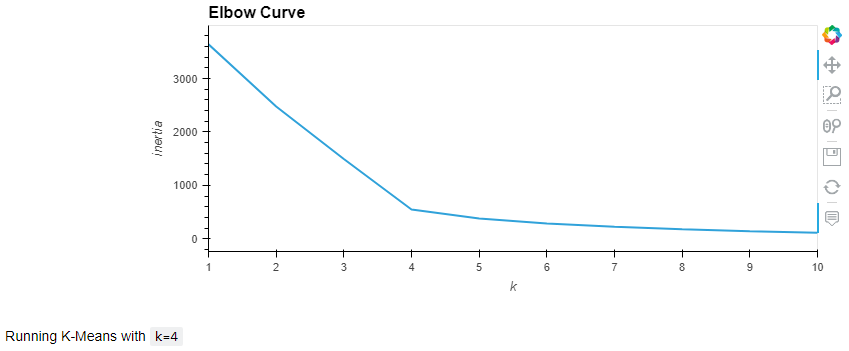
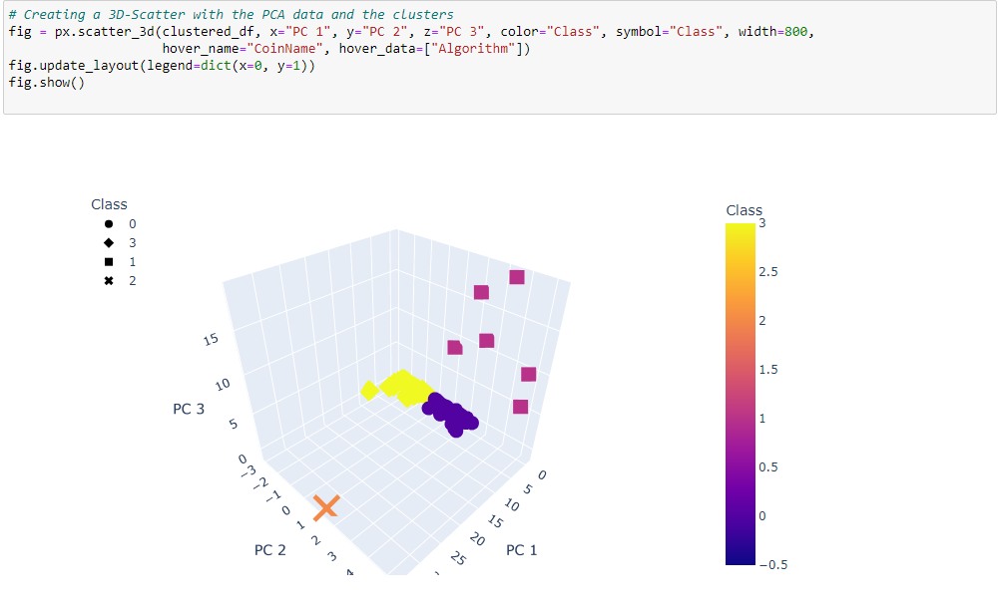
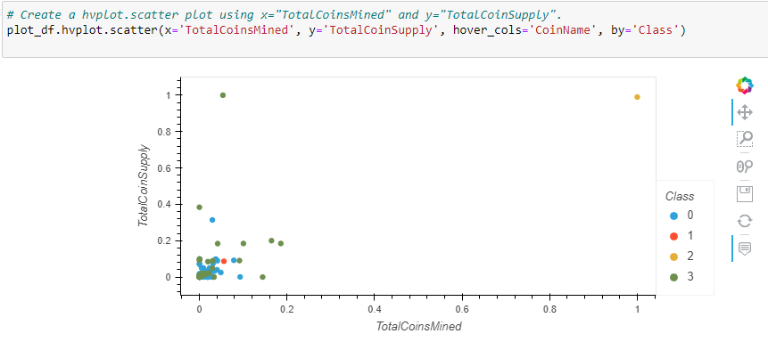
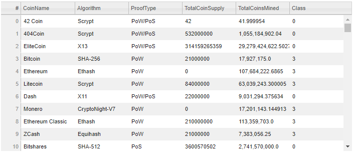

# Cryptocurrencies

## Analysis Overview

The purpose of this analysis is to utilize machine learning to analyze a database of online crypotcurrencies in order to report on tradeable cryptopcurrencies grouped by their features. The report could then be implented into a trading portfolio to be useful for investing firms/ banks. The methods we used for this specific analysis includes using PCA (Principal Component Analysis), and visualizing classification by way of 2D/ 3D scatterplots.

## Results

Our analysis revealed that after we cleaned the data and removed unnecessary columns including null values, it reveals there are 532 tradable cryptocurrencies.

By creating an eblow curve using the K-means method shows that the best k value is 4 therefore an output of having 4 clusters is optimal in categorizing cryptocurrencies.

We also created a 3D scatter plot with clusters of the tradabale cryptocurrencies in order to reduce the dimensions into 3 principal components for further analysis.

A 2D scatter plot was utilized using Principal Component Analysis to further reduce the dimensions to two principal components.

## Tradable Cryptocurrencies

